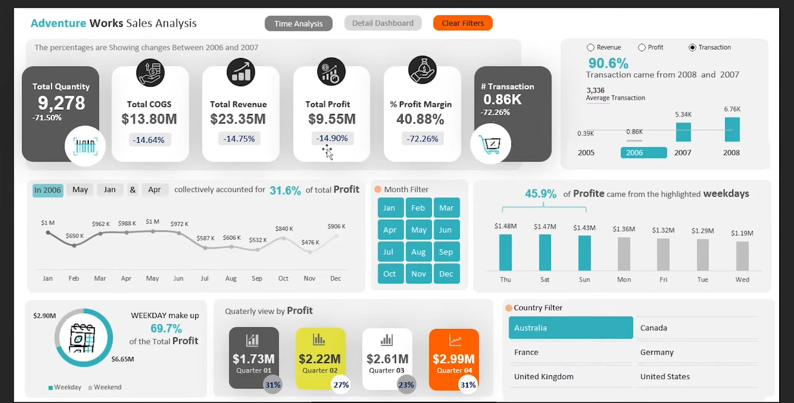
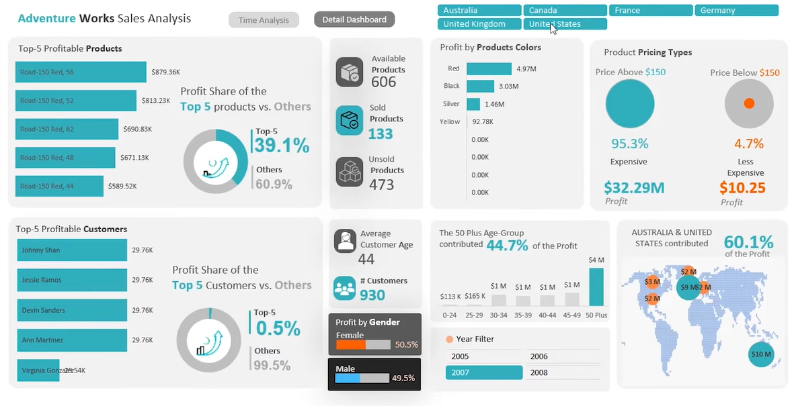

# 📊 Adventure Works Sales & Profit Analysis

An end-to-end profitability analysis of four years of Adventure Works transactional data, built as an interactive Excel dashboard. The project follows a real client brief and is being developed in stages — this repo is updated as each stage is completed.

> 🚧 **Status: In Progress** — see the [Roadmap](#-roadmap) below for what's done and what's coming next.

---

## 📌 Table of Contents
- [Client Brief](#-client-brief)
- [Objective](#-objective)
- [Tools Used](#-tools-used)
- [Dataset](#-dataset)
- [Dashboards](#-dashboards)
- [Key Insights](#-key-insights)
- [Roadmap](#-roadmap)
- [Repository Structure](#-repository-structure)
- [How to Use](#-how-to-use)
- [Contact](#-contact)

---

## 📝 Client Brief

**Requirement:** *"The roadmap that will be your guide for the project."*

> Hello,
>
> I have four years of transactional data that I would like to analyze. My goal is to create visual representations of the data to assess our performance over these years.
>
> I am primarily interested in analyzing our profit. Specifically, I would like to concentrate on the analysis of products, customer locations (countries), and time trends to identify any patterns or trends.

## 🎯 Objective

Turn four years of raw transactional data into a decision-ready Excel dashboard that helps stakeholders answer:
- How is profit trending over time (yearly, quarterly, monthly, weekday)?
- Which products and colors drive the most profit, and which underperform?
- Which customers and demographics (age, gender) are most profitable?
- Which countries/regions contribute the most to profit?
- How does performance compare year-over-year against KPIs like COGS, revenue, and margin?

## 🛠 Tools Used
- **Microsoft Excel** — Power Query (data cleaning/modeling), Pivot Tables, DAX-style measures, slicers, and dynamic dashboard design
- **Data Visualization** — custom KPI cards, dynamic charts, conditional formatting, custom maps

## 🗂 Dataset
- Source: Adventure Works sales data (4 years of transactional records)
- Granularity: Transaction-level, including product, customer, location, and date
- *(Add row count, date range, and a link/description of the raw data source here once finalized.)*

## 📈 Dashboards

### 1. Time Analysis Dashboard
KPI comparisons vs. prior year, monthly/quarterly/weekday profit trends, and country/month filtering.



### 2. Detail Dashboard
Top profitable products and customers, profit by gender/age/color/pricing type, and a country-wise profit map.



## 💡 Key Insights
*(Fill in 3–5 bullet insights once the analysis is finalized — these are the lines recruiters actually read. Examples of the kind of insight to add:)*
- e.g., "Top 5 products contribute 39.1% of total profit; the remaining 601 products contribute the rest."
- e.g., "50+ age group contributes 44.7% of profit despite being a smaller customer segment."
- e.g., "Weekdays account for 69.7% of total profit vs. weekends."

## 🗺 Roadmap

**Time Analysis Dashboard**
- [x] KPI comparison to previous year (COGS, Revenue, Quantity, Profit, Profit Margin, Transactions)
- [x] Yearly performance metrics for above-average years
- [x] Monthly profit trends
- [x] Profit by week type (weekday vs. weekend)
- [x] Quarterly profit analysis
- [x] Profit by weekday

**Detail Dashboard**
- [x] Top 5 profitable products (% contribution vs. others)
- [x] Top 5 profitable customers (% contribution vs. others)
- [x] Profit by gender
- [x] Profit by product color (best sellers)
- [x] Profit by pricing type
- [x] Country-wise profit (custom map)
- [x] Profit by age group

**Next Up**
- [ ] Written insights & executive summary
- [ ] Data cleaning documentation (Power Query steps)
- [ ] PDF/image exports of final dashboards
- [ ] Final polish pass (formatting, tooltips, navigation)

## 📁 Repository Structure
```
adventure-works-sales-analysis/
├── README.md
├── CHANGELOG.md
├── Adventure_Works_Sales_Analysis.xlsx   ← current working file (always latest version)
├── assets/
│   └── screenshots/
│       ├── time-analysis-dashboard.png
│       └── detail-dashboard.png
└── docs/
    └── data-dictionary.md                ← optional, add later
```

## ▶️ How to Use
1. Download `Adventure_Works_Sales_Analysis.xlsx`
2. Open in Excel (enable macros/data connections if prompted)
3. Use the slicers/filters at the top of each dashboard to explore by country, month, or year
4. Switch between **Time Analysis** and **Detail Dashboard** using the navigation buttons

## 📬 Contact
GitHub - https://github.com/Practicecomer
LinkedIn - https://www.linkedin.com/in/shivang-dube-98a7601b8/
